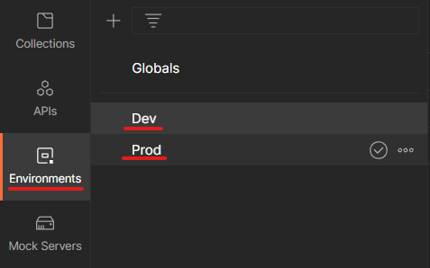
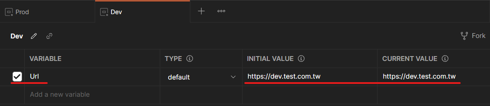
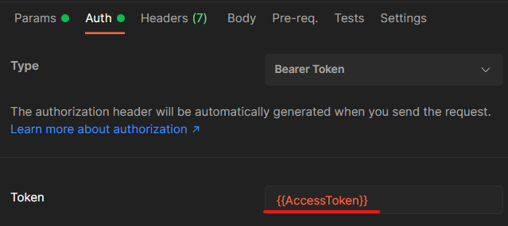
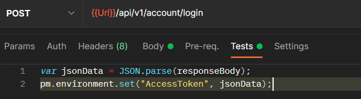

## Postman Environment Variable 簡介

Postman 是一套測試 API 工具，藉著 Environment Variable 的設定，可以很方便切換環境，進行 API 功能驗證，概念很像 asp.net 的 appsettings，只要設定好要置換的內容，就可以使用。

## Environment Variable 設定

- 在 Environment 設定不同環境



- 設定 Variable Name 和 Value



- 使用 Variable 取代原本 Api Url


## 透過 Response 回寫 Environment Variable

使用 Postman 測試 API 會要使用 AccessToken 進行權限的驗證，因此在測試前需要先登入取得 AccessToken 然後複製貼上 Auth 對應欄位，有幾支 API 就要複製幾次，非常麻煩，因此可以透過 Environment Variable 簡化重複貼上的動作。

- 先設定 AccessToken 變數，放在 Auth 對應欄位



- 在取得 AccessToken API 的 Tests 裡輸入 Javascript 語法，當成功取得 AccessToken 回寫 Environment Variable



```javascript
var jsonData = JSON.parse(responseBody);
pm.environment.set("AccessToken", jsonData);
```
