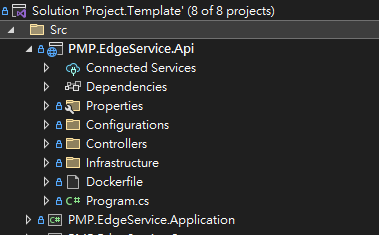
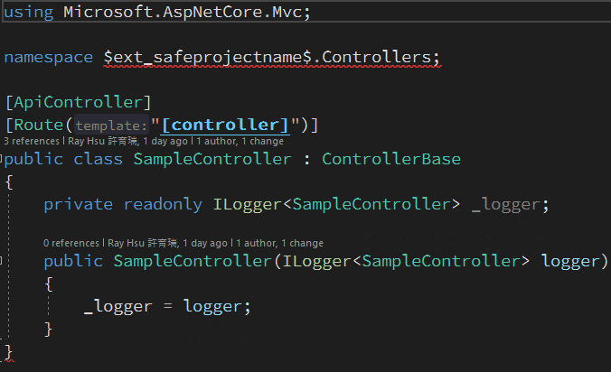
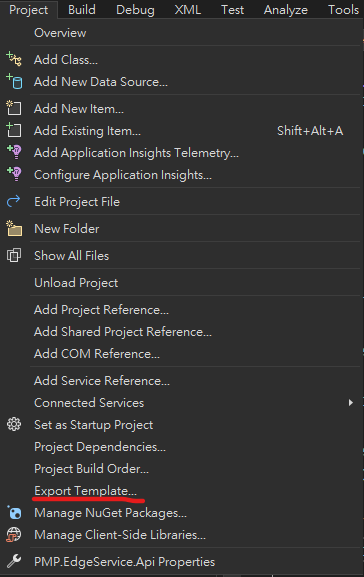
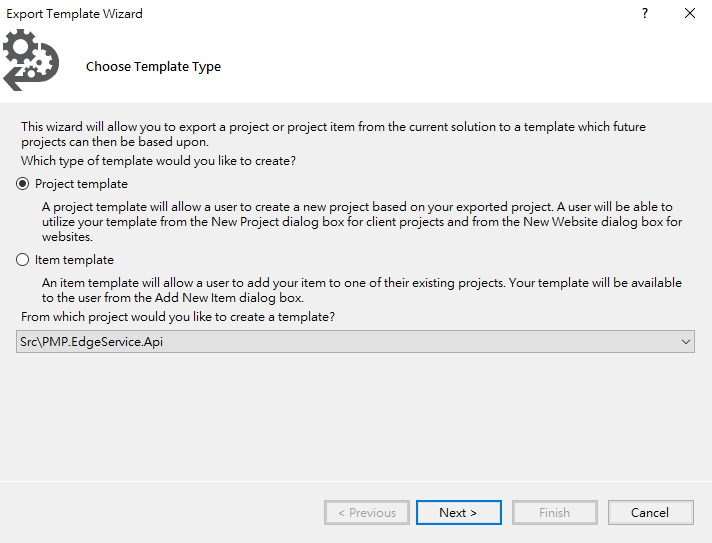
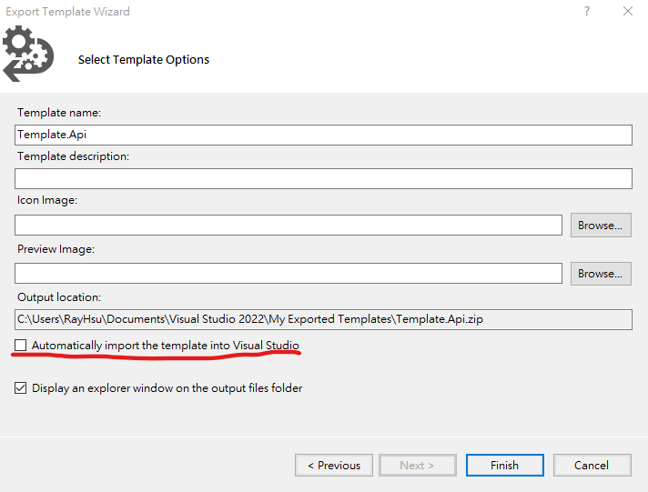
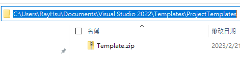
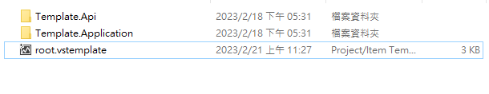
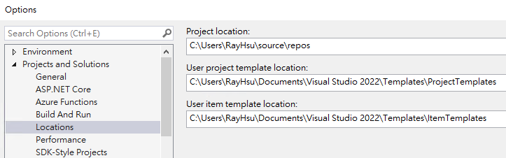
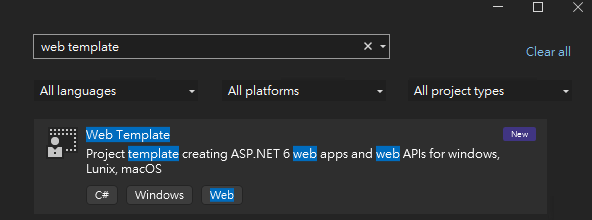

## 起因

隨著工作的經驗增加，接手的案子也越來越多，每個案子使用系統的架構大同小異，但每次開一個新的案子，都需要重新設定或是重新安裝套件，雖然只有一開始才需要設定，但幾次下來也是花了不少時間。

因此這次打算使用 visual studio 匯出專案功能來建立系統範本，使用範本可以大大減少初始系統的設定和安裝套件的時間。

## 專案匯出

- 先建立要使用的系統架構，並安裝相關套件



- 轉換成專案範本，namespace 要使用系統名稱

```CSharp

// 原本的 namepspace
namespace PMP.EdgeService.Api.Controllers;

// 使用範本命名 
namespace $ext_safeprojectname$.Controllers;

```

[參數相關設定](https://learn.microsoft.com/en-us/visualstudio/ide/template-parameters?view=vs-2022)



- 選擇專案匯出範本





- 預設 Automatically Import the template into visual studio 打勾要取消，不要打勾



匯出的 zip 檔，預設路徑為 `C:\Users\{使用者名稱}\Documents\Visual Studio 2022\Templates\ProjectTemplates`



## 設定 template 設定

- 新增一個資料夾，把匯出各別專案範本 zip 檔解壓縮後放置進去。
- 建立系統範本的設定檔，副檔名為`vstemplate`



- 系統範本的設定檔內容如下

```xml

<VSTemplate xmlns="http://schemas.microsoft.com/developer/vstemplate/2005" Version="3.0.0" Type="ProjectGroup">
    <TemplateData>
        <Name>Web Template</Name>
        <Description>Project template creating ASP.NET 6 web apps and web APIs for windows, Lunix, macOS </Description>
        <ProjectType>CSharp</ProjectType>
        <LanguageTag>C#</LanguageTag>
        <PlatformTag>Windows</PlatformTag>
        <ProjectTypeTag>Web</ProjectTypeTag>
        <CreateNewFolder>true</CreateNewFolder>
        <LocationField>Enabled</LocationField>
    </TemplateData>
    <TemplateContent>
        <ProjectCollection>
            <SolutionFolder Name="Src">
                <ProjectTemplateLink ProjectName="$projectname$.Api" CopyParameters="true">Template.Api\MyTemplate.vstemplate</ProjectTemplateLink>
                <ProjectTemplateLink ProjectName="$projectname$.Application" CopyParameters="true">Template.Application\MyTemplate.vstemplate</ProjectTemplateLink>                
            </SolutionFolder>            
        </ProjectCollection>
    </TemplateContent>
</VSTemplate>

```

## 建立系統範本

- 把專案的資料夾和系統範本的設定檔一起壓縮成一個 zip 檔
- 把 zip 放置 visual studio 讀取範本的路徑位置
- 不知道路徑可以在 tools > options > projects and solutions > locations 找到對應路徑 User project template location



- 確認系統範本


