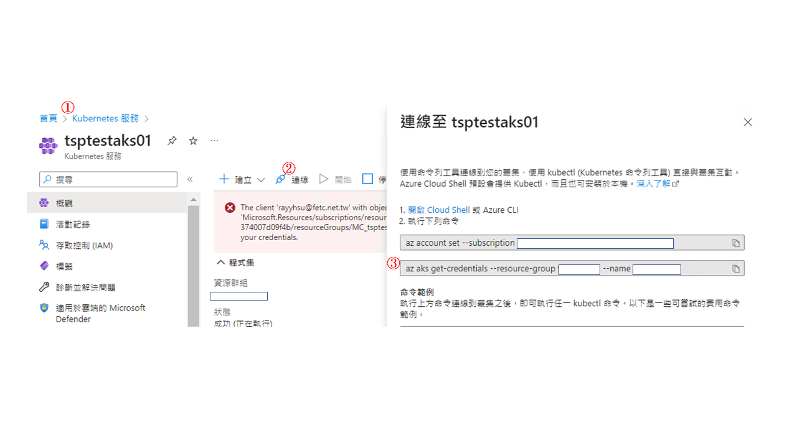
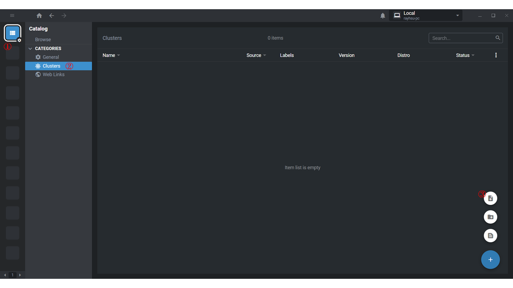
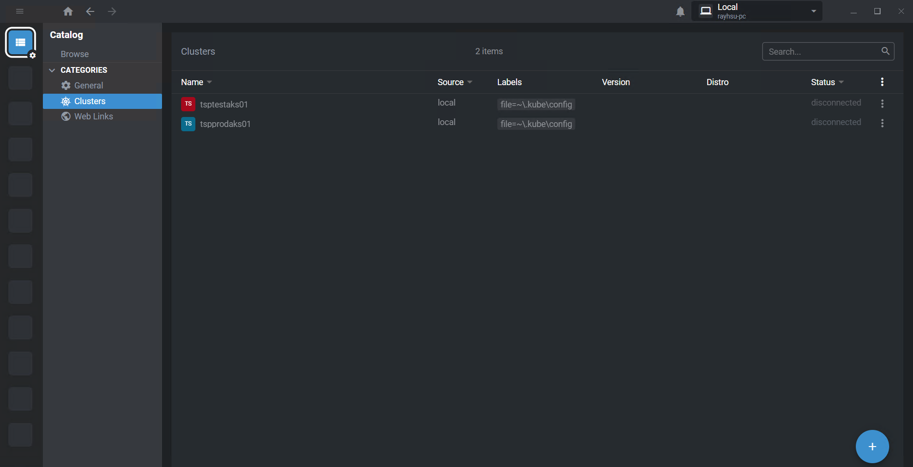
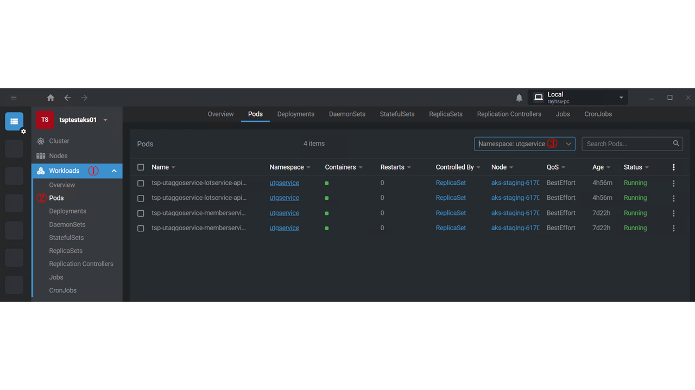

## 起因

最近公司開始導入微服務概念後，工作上的維運也開始有些轉變，系統的佈署從原本的地端改成Azure雲端，並且打包成`Container`佈署在`k8s`上，因此就需要擴充工作上的技能包，最先要提升就是k8s觀念及如何維運在k8s上運行的專案。

所以要怎麼透過工具連到`Azure k8s`就變成很重要。

## Lens 工具

Step1
先註冊帳號，並下載 [Lens](https://k8slens.dev/)

Setp2
由於 k8s 是安裝 Azure 服務上，因此可以透過下指令方式對 Azure 服務操作，下載安裝 [Azure CLI](https://learn.microsoft.com/zh-tw/cli/azure/)

Setp3
由於要透過 IDE 連線 k8s cluster 就必需要有 k8s config 內包含 Cluster、User、Namespace 與身分認證相關資訊，因此要透過 Azure CLI 進行 k8s config 匯出

- 開起 PowserSell 下 Azure CLI 指令

```shell

# step 1 登入 Azure
az login

# step 2 取得憑證，會下載憑證設定，Azure 已產生好語法，只要參考下圖，複製指令執行就可以
az aks get-credentials --resource-group <resource group name> --name <k8s name>

```



- 匯出 k8s config 檔案會放至 `C:\Users\{User}\.kube`，格式大至如下

```yml
apiVersion: v1
clusters:
- cluster:
    certificate-authority-data: <ca-data-here>
    server: https://your-k8s-cluster.com
  name: <cluster-name>
contexts:
- context:
    cluster:  <cluster-name>
    user:  <cluster-name-user>
  name:  <cluster-name>
current-context:  <cluster-name>
kind: Config
preferences: {}
users:
- name:  <cluster-name-user>
  user:
    token: <secret-token-here>
```

Setp4

Lens 讀取 k8s config



讀取成功畫面



找到系統佈署的Pods


